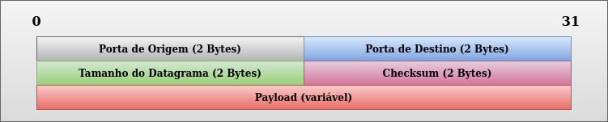

<p align="center">
  
</p>

# UDP 

## Tópicos
* [Introdução](#introdução)
* [Datagrama UDP](#datagrama-udp)
* [Systemcalls utilizados no UDP](#systemcalls-utilizados-no-udp)
* [Preparação do Ambiente](#preparação-do-ambiente)
* [netcat](#netcat)
* [tcpdump](#tcpdump)
* [Implementação](#implementação)
* [Biblioteca](#biblioteca)
* [udp_server.h](#udp_serverh)
* [udp_server.c]($udp_serverc)
* [udp_client.h](#udp_clienth)
* [udp_client.c](#udp_clientc)
* [launch_processes](#launch_processes)
* [button_interface](#button_interface)
* [led_interface](#led_interface)
* [button_process](#button_process)
* [led_process](#led_process)
* [Compilando, Executando e Matando os processos](#compilando-executando-e-matando-os-processos)
* [Compilando](#compilando)
* [Clonando o projeto](#clonando-o-projeto)
* [Selecionando o modo](#selecionando-o-modo)
* [Modo PC](#modo-pc)
* [Modo RASPBERRY](#modo-raspberry)
* [Executando](#executando)
* [Interagindo com o exemplo](#interagindo-com-o-exemplo)
* [MODO PC](#modo-pc-1)
* [MODO RASPBERRY](#modo-raspberry-1)
* [Monitorando o tráfego usando o tcpdump](#monitorando-o-tráfego-usando-o-tcpdump)
* [Testando conexão com o servidor via netcat](#testando-conexão-com-o-servidor-via-netcat)
* [Matando os processos](#matando-os-processos)
* [Conclusão](#conclusão)
* [Referência](#referência)

## Introdução
UDP significa _User Datagram Protocol_, é um protocolo que não precisa se conectar na máquina para qual se quer enviar a mensagem, ou seja, não há a necessidade do _handshake_ presente no [TCP](https://github.com/NakedSolidSnake/Raspberry_IPC_Socket_TCP) necessário para a sua conexão, diante disso essa caracterista o torna muito mais rápido sendo utilizados em aplicações que involvem jogos online, streaming de video e video conferência. Diferente do TCP, o UDP não garante entrega de dados, a máquina que recebe a mensagem não informa que a mensagem foi recebida, dessa forma trazendo consigo a idéia de ser um protocolo não confiável, o que acaba se tornando verdade quando as máquinas precisam usar a internet para se comunicarem(grandes distâncias) podendo entregar os pacotes fora de ordem, mas quando dentro de uma rede local acaba sendo uma opção melhor de utilização.

## Datagrama UDP
O Protocolo UDP é um protocolo simples, devido a sua simplicidade garante uma melhor performance no processamento do protocolo. O UDP opera sobre o protocolo IP a imagem a seguir demonstra como o protocolo UDP é encapsulado no protocolo IPv4

<p align="center">
  
</p>

O Protocolo UDP possui 4 campos de cabeçalho(_header_) e o campo onde os dados são transmitidos chamado de _payload_
<p align="center">
  
</p>

No Header possui um campo de 2 bytes para a porta de origem, um campo de 2 bytes para a porta de destino, mais um campo de 2 bytes para indicar o tamanho do _payload_ a ser enviado e por fim um campo de 2 bytes de checksum. O tamanho máximo de bytes que o UDP pode transmitir é de 64kB(65535 bytes).

## Systemcalls utilizados no UDP
Para criar uma aplicação utilizando TCP utilizamos com conjunto bem específico de funções, sendo elas descritas a seguir:

Cria um endpoint para estabelecer uma comunicação
```c
#include <sys/types.h>
#include <sys/socket.h>

int socket(int domain, int type, int protocol);
```

Faz a junção da porta com o socket
```c
#include <sys/types.h>
#include <sys/socket.h>

int bind(int sockfd, const struct sockaddr *addr, socklen_t addrlen);
```

Permite o envio de mensagens para o endpoint receptor
```c
#include <sys/types.h>
#include <sys/socket.h>

ssize_t sendto(int sockfd, const void *buf, size_t len, int flags, const struct sockaddr *dest_addr, socklen_t addrlen);
```

Permite receber mensagens do endpoint emissor
```c
#include <sys/types.h>
#include <sys/socket.h>

ssize_t recvfrom(int sockfd, void *buf, size_t len, int flags, struct sockaddr *src_addr, socklen_t *addrlen);
```

## Preparação do Ambiente
Antes de apresentarmos o exemplo, primeiro precisaremos instalar algumas ferramentas para auxiliar na análise da comunicação. As ferramentas necessárias para esse artigo são o tcpdump e o netcat(nc), para instalá-las basta executar os comandos abaixo:

```c
sudo apt-get update
```
```c
sudo apt-get install netcat
```
```c
sudo apt-get install tcpdump
```

## netcat 
O netcat é uma ferramenta capaz de interagir com conexões UDP e TCP, podendo abrir conexões, ouvindo como um servidor, ou com cliente enviando mensanges para um servidor.

## tcpdump
O tcpdump é uma ferramenta capaz de monitorar o tráfego de dados em uma dada interface como por exemplo eth0, com ele é possível analisar os pacotes que são recebido e enviados.

## Implementação

Para demonstrar o uso desse IPC, iremos utilizar o modelo Cliente/Servidor, onde o processo Cliente(_button_process_) vai enviar uma mensagem para o Servidor(_led_process_) vai ler a mensagem, e verificar se corresponde com os comandos cadastrados internamente e aplicar o comando caso seja válido. 

## Biblioteca
A biblioteca criada permite uma fácil criação do servidor, sendo o servidor orientado a eventos, ou seja, fica aguardando as mensagens chegarem.

### udp_server.h
Primeiramente criamos um callback responsável por eventos de recebimento, essa função será chamada quando houve esse evento.
```c
typedef void (*Event)(const char *buffer, size_t buffer_size, void *data);
```

Criamos também um contexto que armazena os parâmetros utilizados pelo servidor, sendo o socket para armazenar a instância criada, port que recebe o número que corresponde onde o serviço será disponibilizado, buffer que aponta para a memória alocada previamente pelo usuário, buffer_size o representa o tamanho do buffer e o callback para para recepção da mensagem

```c
typedef struct 
{
    int socket;
    int port;
    char *buffer;
    size_t buffer_size;
    Event on_receive_message;
} UDP_Server;
```

Essa função inicializa o servidor com os parâmetros do contexto
```c
bool UDP_Server_Init(UDP_Server *server);
```
Essa função aguarda uma mensagem enviada pelo cliente.
```c
bool UDP_Server_Run(UDP_Server *server, void *user_data);
```

### udp_server.c

No UDP_Server_Init definimos algumas váriaveis para auxiliar na inicialização do servidor, sendo uma variável booleana que representa o estado da inicialização do servidor, uma variável do tipo inteiro para habilitar o reuso da porta caso o servidor precise reiniciar e uma estrutura sockaddr_in que é usada para configurar o servidor para se comunicar através da rede.

```c
bool status = false;
struct sockaddr_in server_addr;
int yes = 1;
```

Para realizar a inicialização é criado um dummy do while, para que quando houver falha em qualquer uma das etapas, irá sair da função com status de erro, nesse ponto verificamos se o contexto, o buffer e se o tamanho do buffer foi inicializado, sendo sua inicialização de reponsabilidade do usuário

```c
if(!server || !server->buffer || !server->buffer_size)
    break;
```
Criamos um endpoint com o perfil de se conectar via protocolo IPv4(AF_INET), do tipo datagram que caracteriza o UDP(SOCK_DGRAM), o último parâmetro pode ser 0 nesse caso.
```c
server->socket = socket(AF_INET, SOCK_DGRAM, 0);
if(server->socket < 0)
    break;
```
Preenchemos a estrutura com parâmetros fornecidos pelo usuário como em qual porta que o serviço vai rodar.
```c
memset(&server_addr, 0, sizeof(server_addr));

server_addr.sin_family = AF_INET;
server_addr.sin_addr.s_addr = INADDR_ANY;
server_addr.sin_port = htons(server->port);
```

Aqui permitimos o reuso do socket caso necessite reiniciar o serviço
```c
if (setsockopt(server->socket, SOL_SOCKET, SO_REUSEADDR, (void*)&yes, sizeof(yes)) < 0)
    break;
```
Aplicamos as configurações ao socket criado e atribuimos true na variável status
```c
if (bind(server->socket, (const struct sockaddr *)&server_addr, sizeof(server_addr)) < 0)
    break;
status = true;
```

Na função UDP_Server_Run declaramos algumas variáveis para receber as mensagens enviadas pelo cliente

```c
bool status = false;
struct sockaddr_in client_addr;
socklen_t len = sizeof(client_addr);
size_t read_size;
```
Verificamos se o socket é válido e aguardamos uma mensagem do cliente, repassamos a mensagem para o callback realizar o tratamento de acordo com a aplicação do cliente, e retornamos o estado.
```c
if(server->socket > 0)
{
    read_size = recvfrom(server->socket, server->buffer, server->buffer_size, MSG_WAITALL,
                                (struct sockaddr *)&client_addr, &len); 
    server->buffer[read_size] = 0;
    server->on_receive_message(server->buffer, read_size, user_data);
    memset(server->buffer, 0, server->buffer_size);
    status = true;
}

return status;
```

### udp_client.h
Criamos também um contexto que armazena os paramêtros utilizados pelo cliente, sendo o socket para armazenar a instância criada, hostname é o ip que da máquina que vai enviar as mensagens e o port que recebe o número que corresponde qual o serviço deseja consumir

```c
typedef struct 
{
    int socket;
    const char *hostname;
    const char *port;
} UDP_Client;
```

Inicializa o cliente com os parâmetros do descritor 
```c
bool UDP_Client_Init(UDP_Client *client);
```

Envia mensagem para o servidor baseado nos parâmetros do descritor.
```c
bool UDP_Client_Send(UDP_Client *client, const char *message, size_t message_size);
```
### udp_client.c

Na função UDP_Client_Init verificamos se o contexto foi iniciado, e configuramos o socket como UDP

```c
bool status = false;
do 
{
    if(!client)
        break;

    client->socket = socket(PF_INET, SOCK_DGRAM, IPPROTO_UDP);
    if(client->socket < 0)
        break;

    status = true;        
}while(false);

return status;
```

Na função UDP_Client_Send definimos algumas váriaveis para auxiliar na comunicação com o servidor, sendo uma variável booleana que representa o estado de envio para o servidor, uma estrutura sockaddr_in que é usada para configurar o servidor no qual será enviado as mensagens e uma variável de quantidade de dados enviados.

```c
bool status = false;
struct sockaddr_in server;
ssize_t send_len;
```
Parâmetrizamos a estrutura com os dados do servidor
```c
memset(&server, 0, sizeof(server));
server.sin_family = AF_INET;
server.sin_addr.s_addr = inet_addr(client->hostname);
server.sin_port = htons(atoi(client->port));
```
Realizamos o envio da mensagem para o servidor
```c
send_len = sendto(client->socket, message, message_size, 0, (struct sockaddr *)&server, sizeof(server));
  if(send_len == message_size)
      status = true;

return status;
```
Aplicação é composta por três executáveis sendo eles:
* _launch_processes_ - é responsável por lançar os processos _button_process_ e _led_process_ atráves da combinação _fork_ e _exec_
* _button_interface_ - é responsável por ler o GPIO em modo de leitura da Raspberry Pi e escrever o estado interno no arquivo
* _led_interface_ - é responsável por ler do arquivo o estado interno do botão e aplicar em um GPIO configurado como saída

### *launch_processes*

No _main_ criamos duas variáveis para armazenar o PID do *button_process* e do *led_process*, e mais duas variáveis para armazenar o resultado caso o _exec_ venha a falhar.
```c
int pid_button, pid_led;
int button_status, led_status;
```

Em seguida criamos um processo clone, se processo clone for igual a 0, criamos um _array_ de *strings* com o nome do programa que será usado pelo _exec_, em caso o _exec_ retorne, o estado do retorno é capturado e será impresso no *stdout* e aborta a aplicação. Se o _exec_ for executado com sucesso o programa *button_process* será carregado. 
```c
pid_button = fork();

if(pid_button == 0)
{
    //start button process
    char *args[] = {"./button_process", NULL};
    button_status = execvp(args[0], args);
    printf("Error to start button process, status = %d\n", button_status);
    abort();
}   
```

O mesmo procedimento é repetido novamente, porém com a intenção de carregar o *led_process*.

```c
pid_led = fork();

if(pid_led == 0)
{
    //Start led process
    char *args[] = {"./led_process", NULL};
    led_status = execvp(args[0], args);
    printf("Error to start led process, status = %d\n", led_status);
    abort();
}
```

## *button_interface*
Definimos uma lista de comandos que iremos enviar
```c
const char *led_commands[] = 
{
    "LED ON",
    "LED OFF"
};
```
A implementação do Button_Run ficou simples, onde realizamos a inicialização do interface de botão e ficamos em loop aguardando o pressionamento do botão para alterar o estado da variável e enviar a mensagem para o servidor
```c
bool Button_Run(UDP_Client *client, Button_Data *button)
{
    int state = 0;

    if(button->interface->Init(button->object) == false)
        return false;

    if(UDP_Client_Init(client) == false)
        return false;

    while (true)
    {
        wait_press(button);
        state ^= 0x01;
        UDP_Client_Send(client, led_commands[state], strlen(led_commands[state]));
    }

    return false;
}
```
## *led_interface*
A implementação do LED_Run ficou simplificada, realizamos a inicialização da interface de LED, do servidor e ficamos em loop aguardando o recebimento de uma mensagem.
```c
bool LED_Run(UDP_Server *server, LED_Data *led)
{

	if(led->interface->Init(led->object) == false)
		return false;

	if(UDP_Server_Init(server) == false) 
		return false;


	while(true)
	{
		UDP_Server_Run(server, led);
	}

	return false;	
}
```

## *button_process*
A parametrização do cliente fica por conta do processo de botão que inicializa o contexto o endereço do hostname, o serviço que deseja consumir, e assim passamos os argumentos para Button_Run iniciar o processo.

```c
UDP_Client client = 
{
    .hostname = "127.0.0.1",
    .port  = "1234"
};

Button_Run(&client, &button);
```
## *led_process*
A parametrização do servidor fica por conta do processo de LED que inicializa o contexto com o buffer, seu tamanho, a porta onde vai servir e o callback preenchido, e assim passamos os argumentos para LED_Run iniciar o serviço.
```c
UDP_Server server = 
{
    .buffer = server_buffer,
    .buffer_size = BUFFER_SIZE,
    .port = 1234,
    .on_receive_message = on_receive_message
};

LED_Run(&server, &led);
```

A implementação no evento de recebimento da mensagem, compara a mensagem recebida com os comandos internos para o acionamento do LED, caso for igual executa a ação correspondente.
```c
void on_receive_message(const char *buffer, size_t buffer_size, void *data)
{
    LED_Data *led = (LED_Data *)data;

    if(strncmp("LED ON", buffer, strlen("LED ON")) == 0)
        led->interface->Set(led->object, 1);
    else if(strncmp("LED OFF", buffer, strlen("LED OFF")) == 0)
        led->interface->Set(led->object, 0);
}
```

## Compilando, Executando e Matando os processos
Para compilar e testar o projeto é necessário instalar a biblioteca de [hardware](https://github.com/NakedSolidSnake/Raspberry_lib_hardware) necessária para resolver as dependências de configuração de GPIO da Raspberry Pi.

## Compilando
Para faciliar a execução do exemplo, o exemplo proposto foi criado baseado em uma interface, onde é possível selecionar se usará o hardware da Raspberry Pi 3, ou se a interação com o exemplo vai ser através de input feito por FIFO e o output visualizado através de LOG.

### Clonando o projeto
Pra obter uma cópia do projeto execute os comandos a seguir:

```bash
$ git clone https://github.com/NakedSolidSnake/Raspberry_IPC_Socket_UDP
$ cd Raspberry_IPC_Socket_UDP
$ mkdir build && cd build
```

### Selecionando o modo
Para selecionar o modo devemos passar para o cmake uma variável de ambiente chamada de ARCH, e pode-se passar os seguintes valores, PC ou RASPBERRY, para o caso de PC o exemplo terá sua interface preenchida com os sources presentes na pasta src/platform/pc, que permite a interação com o exemplo através de FIFO e LOG, caso seja RASPBERRY usará os GPIO's descritos no [artigo](https://github.com/NakedSolidSnake/Raspberry_lib_hardware#testando-a-instala%C3%A7%C3%A3o-e-as-conex%C3%B5es-de-hardware).

#### Modo PC
```bash
$ cmake -DARCH=PC ..
$ make
```

#### Modo RASPBERRY
```bash
$ cmake -DARCH=RASPBERRY ..
$ make
```

## Executando
Para executar a aplicação execute o processo _*launch_processes*_ para lançar os processos *button_process* e *led_process* que foram determinados de acordo com o modo selecionado.

```bash
$ cd bin
$ ./launch_processes
```

Uma vez executado podemos verificar se os processos estão rodando atráves do comando 
```bash
$ ps -ef | grep _process
```

O output 
```bash
cssouza    814  2334  0 14:47 pts/12   00:00:00 ./button_process
cssouza    815  2334  0 14:47 pts/12   00:00:00 ./led_process
```
## Interagindo com o exemplo
Dependendo do modo de compilação selecionado a interação com o exemplo acontece de forma diferente

### MODO PC
Para o modo PC, precisamos abrir um terminal e monitorar os LOG's
```bash
$ sudo tail -f /var/log/syslog | grep LED
```

Dessa forma o terminal irá apresentar somente os LOG's referente ao exemplo.

Para simular o botão, o processo em modo PC cria uma FIFO para permitir enviar comandos para a aplicação, dessa forma todas as vezes que for enviado o número 0 irá logar no terminal onde foi configurado para o monitoramento, segue o exemplo
```bash
echo "0" > /tmp/udp_fifo
```

Output do LOG quando enviado o comando algumas vezez
```bash
May 20 14:50:13 dell-cssouza LED UDP[815]: LED Status: On
May 20 14:50:13 dell-cssouza LED UDP[815]: LED Status: Off
May 20 14:50:14 dell-cssouza LED UDP[815]: LED Status: On
May 20 14:50:14 dell-cssouza LED UDP[815]: LED Status: Off
May 20 14:50:15 dell-cssouza LED UDP[815]: LED Status: On
May 20 14:50:16 dell-cssouza LED UDP[815]: LED Status: Off
```

### MODO RASPBERRY
Para o modo RASPBERRY a cada vez que o botão for pressionado irá alternar o estado do LED.

## Monitorando o tráfego usando o tcpdump

Para monitorar as mensagens que trafegam, precisamos ler uma interface, para saber quais interfaces que o computador possui usamos o comando

```bash
$ ip a
```
Output
```bash
1: lo: <LOOPBACK,UP,LOWER_UP> mtu 65536 qdisc noqueue state UNKNOWN group default qlen 1000
    link/loopback 00:00:00:00:00:00 brd 00:00:00:00:00:00
    inet 127.0.0.1/8 scope host lo
       valid_lft forever preferred_lft forever
    inet6 ::1/128 scope host 
       valid_lft forever preferred_lft forever
2: enp0s31f6: <BROADCAST,MULTICAST,UP,LOWER_UP> mtu 1500 qdisc fq_codel state UP group default qlen 1000
    link/ether 10:65:30:22:8a:1a brd ff:ff:ff:ff:ff:ff
    inet 192.168.0.140/24 brd 192.168.0.255 scope global dynamic noprefixroute enp0s31f6
       valid_lft 4736sec preferred_lft 4736sec
    inet6 2804:6828:c07d:3800:8e1:7295:eb55:6dc1/64 scope global temporary dynamic 
       valid_lft 296sec preferred_lft 296sec
    inet6 2804:6828:c07d:3800:dcee:5cbc:c056:32a2/64 scope global temporary deprecated dynamic 
       valid_lft 296sec preferred_lft 0sec
    inet6 2804:6828:c07d:3800:72d1:f865:c51c:79de/64 scope global dynamic mngtmpaddr noprefixroute 
       valid_lft 296sec preferred_lft 296sec
    inet6 fe80::3b0:2187:f4da:d8cd/64 scope link noprefixroute 
       valid_lft forever preferred_lft forever
3: wlp2s0: <BROADCAST,MULTICAST> mtu 1500 qdisc noop state DOWN group default qlen 1000
    link/ether 7c:2a:31:df:f0:02 brd ff:ff:ff:ff:ff:ff
4: docker0: <NO-CARRIER,BROADCAST,MULTICAST,UP> mtu 1500 qdisc noqueue state DOWN group default 
    link/ether 02:42:15:e4:fe:cc brd ff:ff:ff:ff:ff:ff
    inet 172.17.0.1/16 brd 172.17.255.255 scope global docker0
       valid_lft forever preferred_lft forever
5: vboxnet0: <BROADCAST,MULTICAST,UP,LOWER_UP> mtu 1500 qdisc fq_codel state UP group default qlen 1000
    link/ether 0a:00:27:00:00:00 brd ff:ff:ff:ff:ff:ff
    inet 172.16.11.100/24 brd 172.16.11.255 scope global vboxnet0
       valid_lft forever preferred_lft forever
    inet6 fe80::800:27ff:fe00:0/64 scope link 
       valid_lft forever preferred_lft forever
```
Como podemos ver temos 5 interfaces no computador onde o comando foi executado, pode ser que a máquina que esteja usando possa ter mais interfaces ou menos interfaces. Para teste local, iremos usar a interface local denominada lo, que representa a interface de loopback.

O tcpdump possui opções que permite a visualização dos dados, não irei explicar tudo, fica de estudo para quem quiser saber mais sobre a ferramenta. Executando o comando

```bash
sudo tcpdump -i lo -nnSX port 1234
```

Após executar o comando o tcpdump ficará fazendo sniffing da interface, tudo o que for trafegado nessa interface será apresentado, dessa forma enviamos um comando e veremos a seguinte saída:
```bash
14:50:16.877785 IP 127.0.0.1.52661 > 127.0.0.1.1234: UDP, length 7
	0x0000:  4500 0023 e5cb 4000 4011 56fc 7f00 0001  E..#..@.@.V.....
	0x0010:  7f00 0001 cdb5 04d2 000f fe22 4c45 4420  ..........."LED.
	0x0020:  4f46 46
```
Podemos ver que não há o processo de handshake somente o envio da mensagem, como descrito a seguir:

* No instante 14:50:16.877785 IP 127.0.0.1.52661 > 127.0.0.1.1234 o cliente envia uma mensagem para o server

## Testando conexão com o servidor via netcat
A aplicação realiza a comunicação entre processos locais, para testar uma comunicação remota usaremos o netcat que permite se conectar de forma prática ao servidor e enviar os comandos. Para se conectar basta usar o seguinte comando:

```bash
nc -u ip port
```

Como descrito no comando ip usaremos o ip apresentado na interface enp0s31f6 que é o IP 192.168.0.140, então o comando fica

```bash
nc -u 192.168.0.140 1234                                                                                                                
```

E enviamos o comando LED ON, se visualizar no log irá apresentar que o comando foi executado, para monitorar com o tcpdump basta mudar a interface

## Matando os processos
Para matar os processos criados execute o script kill_process.sh
```bash
$ cd bin
$ ./kill_process.sh
```

## Conclusão
O UDP é um protocolo utilizado quando se necessita enviar grandes volumes de dados, devido a sua simplicidade garante um maior desempenho em velocidade no envio de mensagens, o fato de não reportar as mensagens que recebeu, isso reduz a quantidade de processamento para tratar o protocolo, esse protocolo é usado também em aplicações de controle, estado e configuração da rede como o DNS(Domain Name System), o DHCP (Dynamic Host Configuration) e o RIP(Routing Information Protocol), nos próximo artigo iremos abordar o seu uso como Broadcast.

## Referência
* [Link do projeto completo](https://github.com/NakedSolidSnake/Raspberry_IPC_Socket_UDP)
* [Mark Mitchell, Jeffrey Oldham, and Alex Samuel - Advanced Linux Programming](https://www.amazon.com.br/Advanced-Linux-Programming-CodeSourcery-LLC/dp/0735710430)
* [fork, exec e daemon](https://github.com/NakedSolidSnake/Raspberry_fork_exec_daemon)
* [biblioteca hardware](https://github.com/NakedSolidSnake/Raspberry_lib_hardware)

